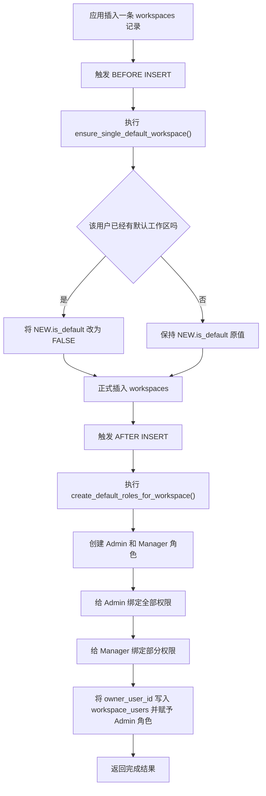

# postgresql 触发器

这篇文档不再讲 PostgreSQL 触发器的通用语法，而是只分析 workspace-kit 初始化 SQL 里的两个触发器。

如果你还不了解 PostgreSQL 触发器本身怎么写、`NEW` / `OLD` / `BEFORE` / `AFTER` 是什么，先看通用文档：

- [PostgreSQL 触发器使用方法](../../../../other/postgresql-trigger/root.md)

这个项目里的触发器主要做两件事：

- 在创建工作区时，自动补齐默认角色、默认权限、工作区创建者成员关系
- 保证同一个用户只有一个默认工作区

<!-- truncate -->

## 这份 SQL 里做了什么

完整逻辑里一共有两个触发器：

1. `ensure_single_default_workspace_trigger`
2. `create_default_roles_for_workspace`

它们都挂在 `workspaces` 表上，但执行时机不同。

## 为什么这个项目要把逻辑放进触发器

如果这套规则放在 Rust 应用层，就意味着每个创建工作区的入口都必须手动执行以下动作：

1. 检查该用户是否已有默认工作区
2. 插入工作区
3. 创建默认角色
4. 给角色绑定权限
5. 把创建者加入工作区成员表

这样的问题是：

- 应用层很容易漏掉某一步
- 未来如果有脚本、后台任务、管理工具直接写数据库，也可能绕过这些规则
- 数据一致性会依赖“每个调用方都记得做同样的事情”

这个项目把这两段逻辑放到 `workspaces` 表触发器里，本质上是在表达一条约束：

“只要有一条工作区记录被创建，数据库就必须自动把后续初始化做完整。”

## 执行流程图

业务上看，创建一个工作区时，数据库内部会走下面这条链路：



这个流程里，第一个触发器负责“修正这条 workspaces 数据本身”，第二个触发器负责“补齐和这条 workspaces 相关的其他表数据”。

## 第一个触发器：保证只有一个默认工作区

```sql
CREATE OR REPLACE FUNCTION ensure_single_default_workspace()
RETURNS TRIGGER AS $$
DECLARE
    default_count INT;
BEGIN
    SELECT COUNT(*) INTO default_count
    FROM workspaces
    WHERE owner_user_id = NEW.owner_user_id
     AND is_default = TRUE;

    IF default_count > 0 THEN
        NEW.is_default = FALSE;
    END IF;

    RETURN NEW;
END;
$$ LANGUAGE plpgsql;

CREATE TRIGGER ensure_single_default_workspace_trigger
BEFORE INSERT ON workspaces
FOR EACH ROW
EXECUTE FUNCTION ensure_single_default_workspace();
```

它的作用是：在插入新工作区之前，先检查这个用户是不是已经有默认工作区。

**它解决了什么问题**

项目里 `workspaces` 表有一个字段：

- `is_default`

它表示这个工作区是不是该用户的默认工作区。

问题在于，数据库表本身并没有写“同一个用户最多只能有一个 `is_default = true`”这样的唯一约束。所以如果应用层不额外处理，就可能出现：

- 同一个用户创建多个默认工作区

这个触发器就是用来兜底这个规则的。

执行逻辑：

1. 根据 `NEW.owner_user_id` 查当前用户已有多少个 `is_default = TRUE` 的工作区
2. 如果已经存在默认工作区，就把这次要插入的 `NEW.is_default` 改成 `FALSE`
3. 返回修改后的 `NEW`，然后 PostgreSQL 再把它真正写入表里

**这里的策略不是报错，而是自动纠正**

它没有阻止插入，也没有抛异常，而是选择：

- 如果已经有默认工作区，就把新工作区自动改成非默认

这意味着项目设计上更偏向“允许创建成功，但自动修正默认标记”，而不是“拒绝这次创建”。

这里必须用 `BEFORE INSERT`，因为它要直接改即将插入的数据：

```sql
NEW.is_default = FALSE;
```

如果改成 `AFTER INSERT`，记录已经写进去了，再改就不是“改这次插入的数据”，而是要额外再执行一次 `UPDATE`，会更绕。

**这一段的实际效果**

假设用户 `u1` 已经有一个默认工作区：

```text
workspace_a -> is_default = true
```

这时应用又插入一条：

```text
workspace_b -> is_default = true
```

触发器会把它改成：

```text
workspace_b -> is_default = false
```

最终结果仍然只有一个默认工作区。

## 第二个触发器：创建工作区后自动补默认数据

```sql
CREATE OR REPLACE FUNCTION create_default_roles_for_workspace()
RETURNS TRIGGER AS $$
DECLARE
    admin_role_id UUID;
    manager_role_id UUID;
BEGIN
    INSERT INTO roles (workspace_id, name, description)
    VALUES
        (NEW.id, 'Admin', 'Workspace administrator with full permissions'),
        (NEW.id, 'Manager', 'Workspace manager with limited permissions');

    SELECT id INTO admin_role_id
    FROM roles
    WHERE workspace_id = NEW.id AND name = 'Admin';

    SELECT id INTO manager_role_id
    FROM roles
    WHERE workspace_id = NEW.id AND name = 'Manager';

    INSERT INTO role_permissions (role_id, permission_id)
    SELECT admin_role_id, id FROM permissions;

    INSERT INTO role_permissions (role_id, permission_id)
    SELECT manager_role_id, id FROM permissions
    WHERE name IN ('view_members', 'view_roles', 'view_permissions', 'invite_members');

    INSERT INTO workspace_users (user_id, workspace_id, role_id, status)
    VALUES (NEW.owner_user_id, NEW.id, admin_role_id, 'active');

    RETURN NEW;
END;
$$ LANGUAGE plpgsql;

CREATE TRIGGER create_default_roles_for_workspace
AFTER INSERT ON workspaces
FOR EACH ROW
EXECUTE FUNCTION create_default_roles_for_workspace();
```

它的作用是：工作区一创建完，就自动完成初始化。

**它解决了什么问题**

系统中的工作区不是只靠 `workspaces` 表一条记录就能工作。一个新工作区创建后，至少还需要：

- 有默认角色
- 角色绑定基础权限
- 创建者自动成为工作区成员

如果没有这段触发器，应用层在创建工作区后还得继续手动插入：

- `roles`
- `role_permissions`
- `workspace_users`

而这类逻辑非常适合由数据库自动补齐。

**具体步骤**

**1. 创建两个默认角色**

```sql
INSERT INTO roles (workspace_id, name, description)
VALUES
    (NEW.id, 'Admin', 'Workspace administrator with full permissions'),
    (NEW.id, 'Manager', 'Workspace manager with limited permissions');
```

这里会给新工作区自动创建：

- `Admin`
- `Manager`

并且都绑定到当前新建的工作区 `NEW.id`。

这说明这个项目默认假设：每个工作区一创建出来，至少就要有这两个基础角色。

**2. 查出刚创建角色的 id**

```sql
SELECT id INTO admin_role_id FROM roles WHERE workspace_id = NEW.id AND name = 'Admin';
SELECT id INTO manager_role_id FROM roles WHERE workspace_id = NEW.id AND name = 'Manager';
```

后面要往 `role_permissions` 和 `workspace_users` 表里插数据，所以需要先拿到角色 id。

这里的写法比较直接：先插入，再查出 id，再往下用。

**3. 给 Admin 绑定全部权限**

```sql
INSERT INTO role_permissions (role_id, permission_id)
SELECT admin_role_id, id FROM permissions;
```

这句的意思是：把 `permissions` 表里所有权限都绑定给 `Admin`。

这意味着 `Admin` 在这个项目里的定位就是“拥有全量权限的工作区管理员”。

**4. 给 Manager 绑定部分权限**

```sql
INSERT INTO role_permissions (role_id, permission_id)
SELECT manager_role_id, id FROM permissions
WHERE name IN ('view_members', 'view_roles', 'view_permissions', 'invite_members');
```

这里不是给全部权限，而是只给一部分查看和邀请相关的权限。

也就是说，`Manager` 不是超管，而是一个权限受限的默认管理角色。

**5. 把工作区创建者加入工作区成员表**

```sql
INSERT INTO workspace_users (user_id, workspace_id, role_id, status)
VALUES (NEW.owner_user_id, NEW.id, admin_role_id, 'active');
```

这句表示：

- 当前工作区创建者自动成为这个工作区成员
- 默认角色是 `Admin`
- 状态是 `active`

从业务上看，这一步非常关键。否则会出现“工作区创建出来了，但创建者本人还没进工作区成员表”的不一致状态。

**为什么这里用 `AFTER INSERT`**

因为它依赖“工作区已经创建成功”这个事实。

此时：

- `NEW.id` 已经是有效的工作区 id
- 可以安全地往 `roles`、`role_permissions`、`workspace_users` 这些关联表插数据

这种“主表插入成功后，顺手初始化附属数据”的场景，用 `AFTER INSERT` 最自然。

## 这两个触发器配合后的效果

把它们合在一起看，这个项目在创建工作区时做到了两件很重要的事：

1. 先保证 `workspaces` 这条记录本身合法
2. 再保证和它相关的角色、权限、成员数据都被初始化

也就是说，应用层只需要把“创建工作区”这一个动作发给数据库，数据库就能把“工作区可用所需的基础数据”全部补好。

## 用业务角度理解

如果没有触发器，应用层通常需要自己手动做下面这些事情：

1. 插入工作区
2. 创建默认角色
3. 绑定权限
4. 把创建者加入工作区
5. 检查默认工作区是否冲突

用了触发器之后，应用层只需要关心一件事：

```sql
INSERT INTO workspaces (...)
VALUES (...);
```

数据库会自动把后续步骤补齐。

这样做的好处是：

- 规则集中在数据库里，不容易漏
- 不管是 Rust 服务、脚本，还是未来别的服务，只要往 `workspaces` 插数据，都会自动遵守同一套规则
- 可以减少应用层重复代码

## 项目里需要注意的点

**1. `permissions` 必须先有数据**

这段 SQL 里有：

```sql
INSERT INTO role_permissions (role_id, permission_id)
SELECT admin_role_id, id FROM permissions;
```

所以前提是 `permissions` 表已经先插入过基础权限。否则角色会创建成功，但角色权限可能是空的。

也就是说，这两个触发器依赖初始化顺序：

- 先有 `permissions`
- 再创建 `workspaces`

**2. 触发器会自动执行**

只要插入 `workspaces` 表，就会触发，不需要应用手动调用。

这既是优点，也是需要留意的地方：调试时要记得“不是只有你写的 INSERT 在生效，后面还有数据库自动逻辑”。

**3. `BEFORE` 用来改 `NEW`，`AFTER` 用来补关联数据**

这篇里的两个触发器，其实就是两个很典型的使用场景：

- `BEFORE INSERT`：改将要入库的数据
- `AFTER INSERT`：基于已创建的数据继续初始化别的表

**4. 项目选择的是“自动纠正”，不是“严格报错”**

第一个触发器遇到默认工作区冲突时，并不会报错，而是自动把新记录改成 `is_default = false`。

这是一种业务取舍：

- 优点：用户创建工作区不会因为默认标记冲突而失败
- 风险：如果调用方本来以为自己成功创建了默认工作区，实际结果可能和预期不同

所以应用层如果非常关心“这次创建后到底是不是默认工作区”，最好还是在插入成功后再读一次结果。

## 这个项目为什么这样设计

从这两段 SQL 能看出来，项目更看重的是：

- 创建工作区后数据立即完整
- 不依赖应用层重复拼装初始化步骤
- 让数据库层直接承担一部分数据一致性责任

这对权限体系、成员体系、默认工作区这类“核心基础数据”来说，是比较合理的设计。

## 完整 SQL

下面是这两个触发器的完整 SQL：

```sql
CREATE OR REPLACE FUNCTION create_default_roles_for_workspace()
RETURNS TRIGGER AS $$
DECLARE
    admin_role_id UUID;
    manager_role_id UUID;
BEGIN
    INSERT INTO roles (workspace_id, name, description)
    VALUES
        (NEW.id, 'Admin', 'Workspace administrator with full permissions'),
        (NEW.id, 'Manager', 'Workspace manager with limited permissions');
    SELECT id INTO admin_role_id FROM roles WHERE workspace_id = NEW.id AND name = 'Admin';
    SELECT id INTO manager_role_id FROM roles WHERE workspace_id = NEW.id AND name = 'Manager';
    INSERT INTO role_permissions (role_id, permission_id)
    SELECT admin_role_id, id FROM permissions;
    INSERT INTO role_permissions (role_id, permission_id)
    SELECT manager_role_id, id FROM permissions
    WHERE name IN ('view_members', 'view_roles', 'view_permissions', 'invite_members');
    INSERT INTO workspace_users (user_id, workspace_id, role_id, status)
    VALUES (NEW.owner_user_id, NEW.id, admin_role_id, 'active');
    RETURN NEW;
END;
$$ LANGUAGE plpgsql;

CREATE TRIGGER create_default_roles_for_workspace
AFTER INSERT ON workspaces
FOR EACH ROW
EXECUTE FUNCTION create_default_roles_for_workspace();

CREATE OR REPLACE FUNCTION ensure_single_default_workspace()
RETURNS TRIGGER AS $$
DECLARE
    default_count INT;
BEGIN
    SELECT COUNT(*) INTO default_count
    FROM workspaces
    WHERE owner_user_id = NEW.owner_user_id
     AND is_default = TRUE;
    IF default_count > 0 THEN
        NEW.is_default = FALSE;
    END IF;
    RETURN NEW;
END;
$$ LANGUAGE plpgsql;

CREATE TRIGGER ensure_single_default_workspace_trigger
BEFORE INSERT ON workspaces
FOR EACH ROW
EXECUTE FUNCTION ensure_single_default_workspace();
```

## 相关链接

- [初始化项目](../root.md)
- [PostgreSQL 触发器使用方法](../../../../other/postgresql-trigger/root.md)
- [PostgreSQL Trigger 文档](https://www.postgresql.org/docs/current/sql-createtrigger.html)
- [PL/pgSQL Trigger Functions](https://www.postgresql.org/docs/current/plpgsql-trigger.html)
